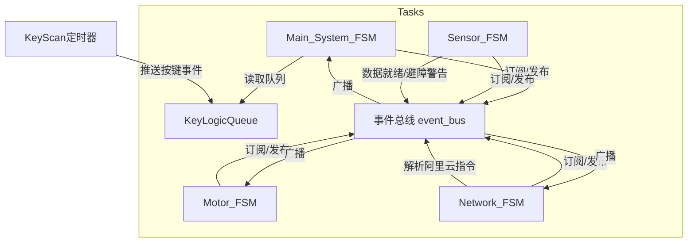
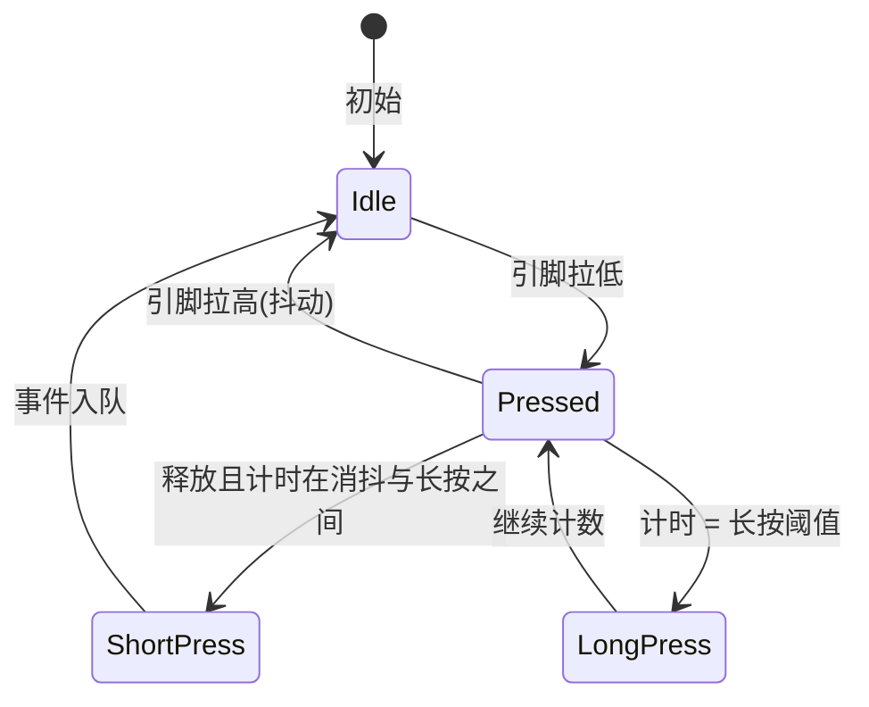
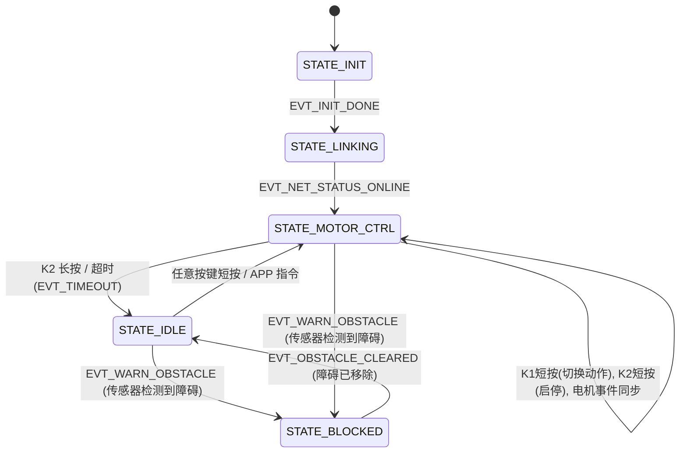
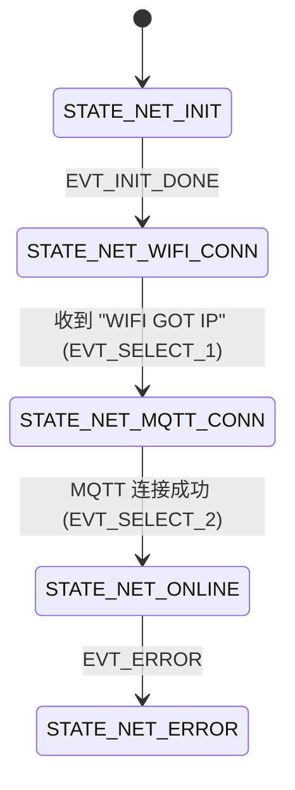
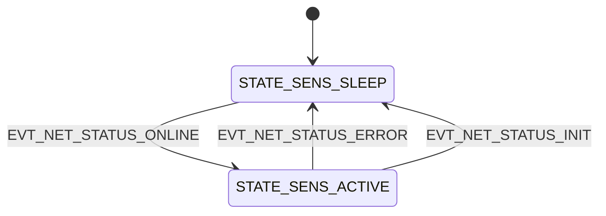
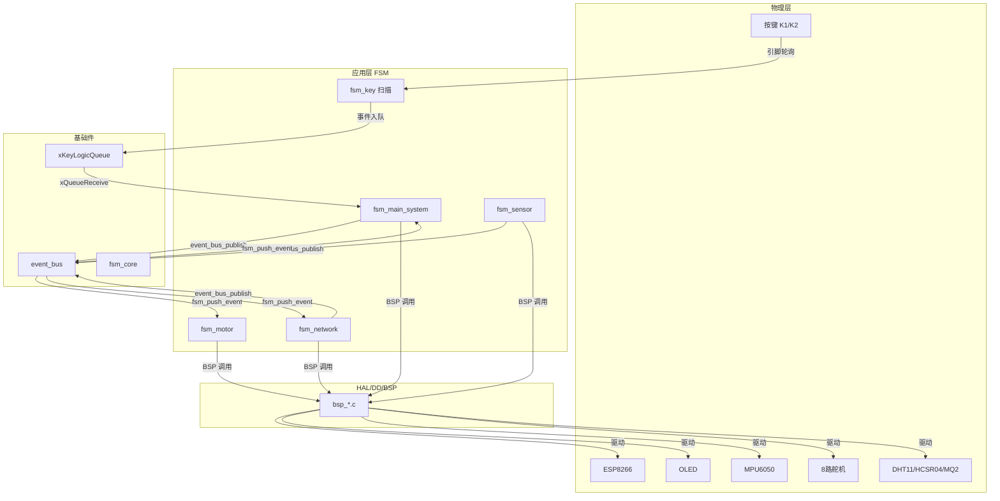

# 四足机器人 FSM 应用层框架文档

## 1. 概述

本项目采用**事件驱动有限状态机（FSM）** 作为应用层核心架构，通过**事件总线**实现模块间解耦。整个应用层由四个独立运行的 RTOS 任务（状态机）组成：

- **主系统控制**：管理操作界面（OLED 显示）和用户交互逻辑。包含避障安全锁。
- **电机控制**：驱动 8 路舵机执行步态序列，并采集 IMU 数据。
- **网络通信**：通过 ESP8266 + MQTT 连接阿里云 IoT，收发控制指令及传感器数据。
- **按键扫描**：基于 FreeRTOS 定时器的按键消抖与状态机，产生短按 / 长按事件。
- **环境传感**：根据网络状态动态休眠/唤醒，非阻塞轮询超声波、DHT11 与烟雾传感器，触发安全拦截。


四个状态机通过**事件总线**相互通信，结构图如下：



## 2. 框架核心模块

### 2.1 状态机核心 (`fsm_core`)---无需修改

提供基于**事件队列**（环形缓冲区）和**状态迁移表**的轻量级状态机实现。

**关键数据结构：**

- `fsm_event_t`：事件 ID + 参数。
- `fsm_transition_t`：迁移规则（当前状态、事件、目标状态、守卫条件、迁移动作）。
- `fsm_state_desc_t`：状态回调（进入/退出/轮询）。
- `fsm_t`：状态机实例句柄，包含事件队列、迁移表、状态描述表、用户数据等。

**主要 API：**

| 函数 | 功能 |
|------|------|
| `fsm_init` | 初始化状态机（绑定队列、迁移表、起始状态） |
| `fsm_set_state_callbacks` | 注册状态回调表（on_enter/on_exit/on_poll） |
| `fsm_push_event` | 向队列推送事件（线程安全，可在中断中调用） |
| `fsm_run` | 驱动状态机：执行当前状态的 `on_poll`，然后处理所有队列中的事件 |

**执行流程：**
1. 每个 RTOS 任务周期调用 `fsm_run`。
2. 先执行当前状态的 `on_poll`（用于非阻塞轮询，如网络 AT 指令发送、舵机序列播放）。
3. 循环取出事件队列中的所有事件，匹配迁移表，依据守卫条件决定是否迁移，执行状态切换回调（`on_exit` → `trans_action` → `on_enter`）或自流转动作。

### 2.2 事件总线 (`event_bus`)---无需修改

实现**订阅 - 发布**模式，采用静态数组存储订阅关系，无动态内存分配。

**主要 API：**

| 函数 | 功能 |
|------|------|
| `event_bus_init` | 清空订阅表 |
| `event_bus_subscribe(fsm, event_id)` | 状态机订阅指定事件 ID |
| `event_bus_publish(event_id, param)` | 广播事件，所有订阅者都会收到 |

**容量限制：** 由 `sys_config.h` 中的 `BUS_MAX_SUBS` 定义（示例为 32）。订阅超限会静默失败。

### 2.3 系统事件定义 (`sys_events.h`)--可增删查改

所有事件 ID 集中在枚举 `sys_event_t` 中，按功能分组：

- **物理输入**：`EVT_KEY1_SHORT_PRESS`, `EVT_KEY1_LONG_PRESS`, `EVT_KEY2_...`
- **系统内部**：`EVT_INIT_DONE`, `EVT_SELECT_1/2/3`, `EVT_TIMEOUT`, `EVT_ERROR`
- **电机指令**：`EVT_MOTOR_STOP/FORWARD/BACKWARD/LEFT/RIGHT/ROT_L/ROT_R`, `EVT_MOTOR_EXECUTE`
- **网络状态**：`EVT_NET_STATUS_INIT/WIFI_CONN/MQTT_CONN/ONLINE/ERROR`
- **欧拉角上报**：`EVT_NET_EULER_OPEN`, `EVT_NET_EULER_CLOSE`
- **传感器与避障**：`EVT_WARN_OBSTACLE`, `EVT_OBSTACLE_CLEARED`, `EVT_SENSOR_DATA_READY`


### 2.4 全局配置 (`sys_config.h`)--可增删查改

统一管理 RTOS 依赖、临界区、调试开关。

```c
#define USE_FREERTOS              // 启用 FreeRTOS 支持
#define BUS_MAX_SUBS 32           // 事件总线最大订阅数
#define ENABLE_DEBUG_PRINT 0      // 全局调试打印开关（1 开，0 关）

// FreeRTOS 模式下提供的工具宏
#define FSM_GET_TICK()       xTaskGetTickCount()
#define FSM_MS_TO_TICKS(ms)  pdMS_TO_TICKS(ms)
#define FSM_DELAY_MS(ms)     vTaskDelay(pdMS_TO_TICKS(ms))
#define FSM_ENTER_CRITICAL() taskENTER_CRITICAL()
#define FSM_EXIT_CRITICAL()  taskEXIT_CRITICAL()
```

当 `ENABLE_DEBUG_PRINT == 0` 时，`printf` 被宏替换为空操作，`SYS_LOG` 等日志宏也失效。

---

## 3. 应用层状态机详细设计

### 3.1 按键扫描状态机 (`fsm_key`)

**文件：** `fsm_key.c/h`  
**任务方式：** 不单独创建任务，使用 FreeRTOS **软件定时器** 每 10ms 触发一次扫描。

**引脚定义：**

| 按键 | GPIO | 功能 | 事件 |
|------|------|------|------|
| K1 | PA12 | 模式选择 | `EVT_KEY1_SHORT_PRESS` / `EVT_KEY1_LONG_PRESS` |
| K2 | PB13 | 确认 / 停止 | `EVT_KEY2_SHORT_PRESS` / `EVT_KEY2_LONG_PRESS` |

**消抖逻辑：**
- 按下持续扫描，累加计数器 `press_cnt`。
- 当 `press_cnt >= KEY_DEBOUNCE_TICKS`（2 ticks = 20ms）且释放时，判定为短按，发送短按事件到 `xKeyLogicQueue`。
- 若 `press_cnt == KEY_LONG_TICKS`（80 ticks = 800ms），触发长按事件（一次性），并继续计数。
**输出队列：** `xKeyLogicQueue`，由主系统状态机任务接收。
**队列创建：** 队列在 `KEY_Init` 前由主任务创建，长度为 8，元素为 `uint16_t`。


### 3.2 主系统状态机 (`fsm_main_system`)

**文件：** `fsm_main_system.c/h`  
**任务：** `Main_System_FSM_task`，周期 50ms。

**状态定义：**

| 状态 | 含义 |
|------|------|
| `STATE_INIT` | 系统初始化 |
| `STATE_LINKING` | 等待网络连接（MQTT 上线） |
| `STATE_IDLE` | 待机界面（OLED 显示待机） |
| `STATE_MOTOR_CTRL` | 电机控制界面（显示动作菜单） |
| `STATE_BLOCKED` | 避障锁定状态（物理隔离所有指令） |
| `STATE_ERROR` | 错误状态（预留） |

**状态流转图：**



**关键上下文：**

- `m1_menu_index`：当前选中的电机动作索引（`MOTOR_ITEMS`）。
- `run_source`：0 = 停止，1 = 本地按键，2 = APP 云端。用于 OLED 显示区分来源。
- `xMenuTimer`：10 秒无操作自动进入 IDLE 的单次定时器。有动作时重启或停止。

**主要功能：**

- 读取 `xKeyLogicQueue` 获得按键事件，直接推入自己的 FSM。
- 通过事件总线订阅以下事件，实现与被控端的解耦：
  - `EVT_NET_STATUS_ONLINE`
  - `EVT_MOTOR_STOP/FORWARD/BACKWARD/LEFT/RIGHT/ROT_L/ROT_R`
  - `EVT_WARN_OBSTACLE`、`EVT_OBSTACLE_CLEARED`   <!-- 新增 -->
- 根据当前状态和事件，向总线发布电机控制指令（`event_bus_publish`）。
- 更新 OLED 显示（`BSP_OLED_ShowString` 等）。
- **避障安全锁**：当收到 `EVT_WARN_OBSTACLE` 时强制进入 `STATE_BLOCKED`，立即停止电机、清除运行源并关闭待机定时器，该状态下**不再响应**任何按键或 APP 指令，直到收到 `EVT_OBSTACLE_CLEARED` 后返回 `STATE_IDLE`，实现物理隔离。

### 3.3 电机控制状态机 (`fsm_motor`)

**文件：** `fsm_motor.c/h`  
**任务：** `Motor_FSM_task`，周期 20ms。

**状态定义：** 与电机运动一一对应：

- `STATE_MOTOR_STOP`
- `STATE_MOTOR_FORWARD`
- `STATE_MOTOR_BACKWARD`
- `STATE_MOTOR_LEFT`
- `STATE_MOTOR_RIGHT`
- `STATE_MOTOR_ROT_L`
- `STATE_MOTOR_ROT_R`

**驱动原理：** 采用**数据驱动的步态序列**。每种动作预定义一个 `gait_sequence_t`，包含若干 `pose_frame_t`（8 路舵机角度）。状态机的 `on_poll` 回调按照固定时间间隔（500ms）顺序播放帧，循环执行。

**数据结构示例：**

```c
static const pose_frame_t DATA_FORWARD[] = {
    { {55,90,90,90,55,90,90,90} },   // 抬腿
    { {55,55,90,90,55,125,90,90} }, // 摆动
    ...
};
DEFINE_SEQ(SEQ_FORWARD, DATA_FORWARD);
```

**状态转换表：** 使用宏 `TRANS_ANY` 生成从任意当前状态到目标状态的迁移规则。例如收到 `EVT_MOTOR_FORWARD` 时，无论当前在何状态，都切换到 `STATE_MOTOR_FORWARD`。进入状态时调用 `enter_forward` 加载序列并立即执行第一帧。

**IMU 集成：** 在任务循环中检查 MPU6050 的就绪标志，读取欧拉角存入全局变量 `g_imu_data`，供网络任务上报。

### 3.4 网络通信状态机 (`fsm_network`)

**文件：** `fsm_network.c/h`  
**任务：** `Network_FSM_Task`，无固定周期（依赖队列阻塞和 FSM 轮询）。

**状态定义：**

| 状态 | 含义 |
|------|------|
| `STATE_NET_INIT` | 发送 AT 指令初始化 WiFi 模块 |
| `STATE_NET_WIFI_CONN` | 连接 WiFi |
| `STATE_NET_MQTT_CONN` | MQTT 配置与连接 |
| `STATE_NET_ONLINE` | 在线，可收发数据 |
| `STATE_NET_ERROR` | 错误状态 |

**状态流转图：**



**关键行为：**

- **INIT 阶段：** 通过 `on_poll` 以非阻塞方式逐步发送 AT 指令（AT+RST、ATE0、AT+CWMODE=1），每步间隔 1 秒，防止堵塞。
- **WIFI 连接：** 在 `on_enter_wifi` 中发送 AT+CWJAP。
- **MQTT 连接：** 分步进行清理、用户配置、客户端 ID、连接、订阅主题，每个步骤之间至少间隔 2~3 秒。
- **在线状态：** 持续 `on_poll_online`，定时发布传感器数据（温度/湿度/烟雾/光照）以及欧拉角（若开启）。同时解析来自阿里云的下行 JSON，根据 `"value":1` 和动作名称向事件总线发布电机指令或欧拉角开关事件。
- **欧拉角上报开关：** 在网络状态机的 `on_poll_online` 中动态检查。该功能由 APP 通过解析 `Euler_angle_open` 字段控制，`value:1` 发布 `EVT_NET_EULER_OPEN` 事件触发 `action_euler_switch` 置位使能位。
- **阿里云 JSON 解析：** 使用简单的子串匹配 `strstr`，支持的控制指令：

- `"move_on"`, `"move_back"`, `"move_left"`, `"move_right"`, `"move_left_rotate"`, `"move_right_rotate"`, `"move_stop"`
- `"Euler_angle_open"` 及 `"value":1` / `"value":0` 控制欧拉角上报开关。

**调试模式暂停：** 若 `ENABLE_DEBUG_PRINT` 开启且通过调试串口收到任意数据，设置 `g_fsm_paused = 1`，网络状态机的 `on_poll` 将停止执行，以便手动控制 ESP8266。

---


### 3.5 传感器状态机 (`fsm_sensor`)

**文件：** `fsm_sensor.c/h`  
**任务：** `Sensor_FSM_Task`，动态周期（ACTIVE 态 100ms，SLEEP 态 500ms）。

**状态定义：**

| 状态 | 含义 |
|------|------|
| `STATE_SENS_SLEEP` | 休眠模式，硬件暂停，等待网络上线 |
| `STATE_SENS_ACTIVE` | 活跃采集模式，硬件运行，轮询传感器 |

**状态流转图：**



**主要功能：**
- **状态切换**：根据网络状态自动休眠/唤醒硬件传感器，节省功耗。
- **非阻塞采集**：聚合超声波、烟雾（ADC）与 DHT11 的数据，仅在 ACTIVE 状态下执行。
- **数据共享**：维护全局结构体 `g_sensor_data` 供网络状态机定时读取与上报。
- **避障裁决**：当距离在 `(2cm, 15cm)` 区间时，发布 `EVT_WARN_OBSTACLE`；当距离恢复至 `≥17cm` 时，发布 `EVT_OBSTACLE_CLEARED`。带有 2cm 物理迟滞，避免临界抖动。
- **DHT11 降频读取**：每 20 次轮询（约 2 秒）才读取一次温湿度，减少硬件抢占开销。


---


## 4. 事件流与订阅关系总览

| 事件 ID | 发布者 | 订阅者（状态机） | 用途 |
|---------|--------|------------------|------|
| `EVT_KEY*_PRESS` | 按键扫描（队列） | Main_System | 用户界面交互 |
| `EVT_INIT_DONE` | Main_System / Network | 各自内部 / Main | 初始化完成通知 |
| `EVT_NET_STATUS_ONLINE` | Network | Main_System | 通知主控网络已可用 |
| `EVT_MOTOR_*` | Main_System（按键 / 菜单）或 Network（APP） | Motor | 执行舵机动作 |
| `EVT_SELECT_1/2` | Network 内部（解析串口返回） | Network 自身 | 驱动 WiFi → MQTT → ONLINE 的流转 |
| `EVT_NET_EULER_OPEN/CLOSE` | Network（解析 APP 指令） | Network 自身 | 控制欧拉角上报 |
| `EVT_TIMEOUT` | 主系统内部 (IdleTimeoutTimer) | Main_System 自身 | 10秒无操作切至待机 |
| `EVT_KEY*_PRESS` | 按键扫描 | Main_System | K1/K2 长短按用于菜单和启停 |
| `EVT_WARN_OBSTACLE/EVT_OBSTACLE_CLEARED` | Sensor | Main_System | 避障安全锁的触发和解除 |
| `EVT_NET_STATUS_INIT` | Network | Sensor | 网络复位时通知传感器进入休眠 |
| `EVT_NET_STATUS_ERROR` | Network | Sensor | 网络异常时通知传感器进入休眠 |


**发布方式：**
- 按键事件通过 **FreeRTOS 队列** `xKeyLogicQueue` 传递给 Main_System 任务。
- 其他跨任务事件均通过 **事件总线** `event_bus_publish` 广播。

---

## 5. 任务与定时器配置

| 任务 / 定时器 | 调度方式 | 周期 / 触发条件 |
|--------------|----------|----------------|
| `KeyScanTimer` | 软件定时器 | 10ms 周期性 |
| `Main_System_FSM_task` | RTOS 任务 | 50ms 周期（vTaskDelayUntil） |
| `Motor_FSM_task` | RTOS 任务 | 20ms 周期 |
| `IdleTimeoutTimer` | 单次定时器 | Main_System 中 10 秒超时进入待机 |
| `Network_FSM_Task` | RTOS 任务 | 事件驱动 + 50ms 轮询超时（ `xQueueReceive` 非阻塞） |
| `Sensor_FSM_Task` | RTOS 任务 | 动态周期（ACTIVE 态 100ms，SLEEP 态 500ms） |

---

## 6. 调试与日志系统

在 `sys_config.h` 中通过 `ENABLE_DEBUG_PRINT` 控制全工程日志输出。

- **开启时：** `SYS_LOG("TAG", "format", ...)` 可输出带标签的调试信息；`printf` 重定向到 USART2（调试串口）。
- **关闭时：** 所有 `printf`、`SYS_LOG` 和 `LOG_RAW` 均替换为 `((void)0)`，不占用串口带宽和 Flash 空间。

建议开发阶段设为 `1`，发布时设为 `0`。

此外，网络状态机还支持**调试暂停机制**：当 `ENABLE_DEBUG_PRINT == 1` 且通过调试串口接收到数据时，`g_fsm_paused` 置位，暂停自动轮询，以便手动调试 WiFi 模块。
注意: 暂停期间，电机 FSM 和主系统 FSM 的状态轮询不受影响。该机制仅在 Debug 版本生效。
---

## 7. 完整架构图





## 8. 扩展与二次开发指南

- **添加新事件：** 在 `sys_events.h` 枚举中添加，但需在 `EVT_MAX_NUM` 之前。随后在需要响应的状态机迁移表中增加相应条目，并通过 `event_bus_subscribe` 订阅。
- **添加新状态：** 在对应状态机的状态枚举中添加，设计迁移规则，实现 `on_enter/on_exit/on_poll` 回调，并注册到 `fsm_state_desc_t` 数组中。
- **添加新动作序列：** 在 `fsm_motor.c` 中参照 `DATA_FORWARD` 格式定义 `pose_frame_t` 数组，创建 `gait_sequence_t`，然后增加对应的进入回调、状态和转换规则。
- **修改阿里云解析逻辑：** 根据实际的物模型 JSON，调整 `parse_aliyun_payload` 中的字符串匹配。

---

> **版本记录：** V1.0  
> **适用硬件：** STM32F103 + ESP8266 + MPU6050 + SSD1306  
> **依赖：** FreeRTOS, STM32 标准外设库, INV_MPU/DMP 库