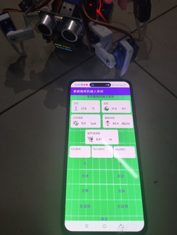
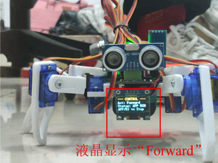
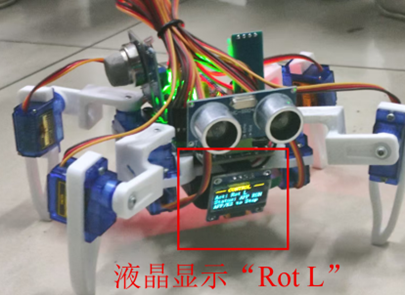
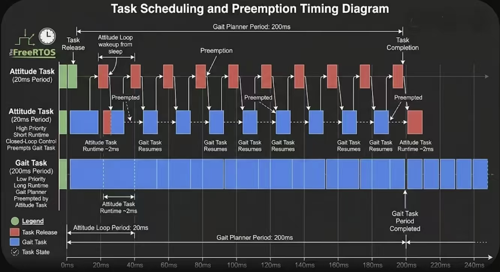

# 四足仿生蜘蛛机器人（STM32-Robot）

> **本项目为个人架构练习，主要展示多任务实时调度与姿态融合算法，非完整成品机器人。**

**项目周期**：2025.10 - 2025.12
**仓库地址**：https://github.com/2396344866/STM32-Robot.git

## 一、 项目简介
本项目基于 STM32 与 FreeRTOS 搭建分布式嵌入式控制系统。系统实现四足机器人在复杂地形下的稳定行走。软件架构完成严格的分层解耦。系统执行多任务并发调度、IMU 姿态解算与闭环步态控制。机器人最终实现多步态平稳切换与运动稳定控制。

## 二、 系统架构与硬件构成

控制系统由以下独立模块构成：
1. **主控中枢**：STM32F103 运行 FreeRTOS。事件总线架构作为核心中枢进行并发调度。系统通过接口与外围模块连接。
2. **电源模块**：电源模块分离弱电回路与高功率回路。弱电回路供电主控板与传感器。高功率回路专门供电 8 路舵机。
3. **远程监控**：阿里云 IoT 客户端通过 MQTT 协议连接设备。PC 或智能手机下发控制指令。系统实时监测并同步环境遥测数据。
4. **姿态感知**：MPU6050 倾角传感器采集空间姿态。硬件 I2C 接口将欧拉角数据传送至主控板。系统执行后续姿态调整。
5. **环境感知**：超声波、DHT11、MQ2、光照模块接入系统。ADC 与定时器输入捕获模块将物理量转换为数字信号供系统轮询。
6. **执行机构**：8 个机械关节由舵机驱动。主控芯片输出低压 PWM 信号直接驱动机械关节。执行机构按照状态机下发的步态帧序列运行。

## 三、 核心技术实现

### 1. 分层软件架构：HAL/DD/BSP 三层隔离
系统利用 HAL 库封装 MCU 片内外设。底层隔离寄存器级别的硬件操作。
中间 DD 设备层搭建无硬件寄存器依赖的纯逻辑驱动代码。系统实现软硬件解耦。
BSP 板级支持层通过结构体函数指针（V-Table虚表）实现硬件依赖动态注入。代码具备跨平台移植能力。
*详细设计文档参见：[HAL底层说明](docs/HAL.md) | [DD驱动层说明](docs/DEV.md) | [BSP板级支持](docs/BSP.md)*

### 2. 多任务并发调度：FSM + 事件总线

系统基于 FreeRTOS 搭建事件驱动有限状态机 (FSM)。
自研轻量级事件总线采用发布-订阅模式。总线解耦电机控制、传感器采集与网络通信任务。
系统机制实现非阻塞轮询。调度器避免任务互相抢占造成的系统卡顿。
*状态机文档参见：[FSM架构说明](docs/FSM.md)*

### 3. 高频数据采集与运动解算

系统封装 MPU6050 硬件驱动。驱动调用 DMP 库完成 IMU 姿态解算。
系统配置 ADC 与 DMA 模块。硬件实现多路传感器同步高频数据采集。
系统采用双频任务调度机制：
- **低频任务（200ms）**：步态轨迹发生器计算运动帧。
- **高频闭环（20ms）**：姿态补偿控制环执行实时位置纠偏。

### 4. 运动算法闭环控制
控制器读取 IMU 姿态信息作为外环输入。自适应 PID 控制器进行闭环调节。
系统增加奇异点包裹算法。算法解决欧拉角翻转跳变问题。
系统完成 6 套行走步态计算。步态支持平滑切换。系统具备地形防撞拦截逻辑。

---

# STM32-Robot
**Embedded Control System for Quadruped Bionic Spider Robot**

> This project is a personal architectural exercise. It mainly demonstrates multi-task real-time scheduling and attitude fusion algorithms. It is not a complete finished robot.

**Project Info**
- **Time**: 2025.10 - 2025.12
- **Platform**: STM32 + FreeRTOS

## Key Features

### 1. Layered Architecture
The system implements HAL / DD / BSP three-tier isolation. The code utilizes function pointer v-tables to decouple hardware logic. The design achieves cross-platform transplantation capability.

### 2. Multi-task Scheduling
The architecture utilizes an event-driven FSM and a lightweight event bus (Publish-Subscribe mode). The RTOS decouples motor, sensor, and communication tasks.

### 3. IMU & Motion Control
The system executes MPU6050 DMP attitude calculation and ADC+DMA multi-channel sampling. The scheduler implements a dual-frequency scheduling logic (200ms gait planner + 20ms high-speed compensation loop).

### 4. Control Algorithm
The controller applies an adaptive PID and an Euler angle anti-jump algorithm. The robot realizes 6 kinds of gait switching with anti-collision protection logic.
