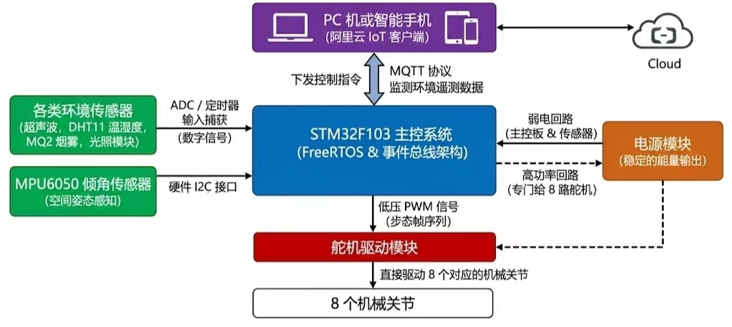
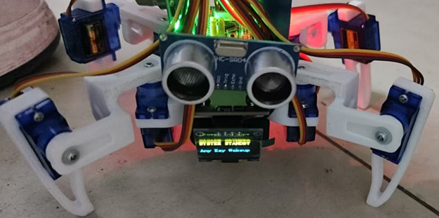

# 面向家庭服务的四足机器人分布式系统（STM32-Robot）

**项目定位**：面向复杂地形的高频自适应姿态控制与分布式调度系统
**项目周期**：2025.10 - 2026.06
**仓库地址**：https://github.com/2396344866/STM32-Robot.git

## 一、 项目简介
本项目基于 STM32 与 FreeRTOS 搭建分布式嵌入式控制系统。系统实现四足机器人在复杂地形下的稳定行走。软件架构完成严格的分层解耦。系统执行多任务并发调度、IMU 姿态解算与闭环步态控制。机器人最终实现多步态平稳切换与运动稳定控制。

## 二、 系统架构与硬件构成

控制系统由以下独立模块构成：
1. **主控中枢**：STM32F103 运行 FreeRTOS。事件总线架构作为核心中枢进行并发调度。系统通过接口与外围模块连接。
2. **电源模块**：电源模块分离弱电回路与高功率回路。弱电回路供电主控板与传感器。高功率回路专门供电 8 路舵机。
3. **远程监控**：阿里云 IoT 客户端通过 MQTT 协议连接设备。PC 或智能手机下发控制指令。系统实时监测并同步环境遥测数据。
4. **姿态感知**：MPU6050 倾角传感器采集空间姿态。硬件 I2C 接口将欧拉角数据传送至主控板。系统执行后续姿态调整。
5. **环境感知**：超声波、DHT11、MQ2、光照模块接入系统。ADC 与定时器输入捕获模块将物理量转换为数字信号供系统轮询。
6. **执行机构**：8 个机械关节由舵机驱动。主控芯片输出低压 PWM 信号直接驱动机械关节。执行机构按照状态机下发的步态帧序列运行。

## 三、 核心技术实现

### 1. 基于双频解耦的运动学与位姿补偿算法

微控制器的算力极其有限。单片机无法实时运行高时间复杂度的矩阵逆运动学解算。系统构建了频率解耦的半动态位姿补偿框架。系统将控制逻辑拆分为两个独立的执行轴。

* **步态数据驱动轴（200ms）**：系统采用查表法替代实时计算。系统将浮点运算压缩为固定的时间切片查找。
* **姿态补偿控制轴（20ms）**：系统采用奇异点包裹算法与 PD 控制律。系统通过最短路径取模操作，消除了欧拉角翻转导致的积分爆炸。系统将 DMP 库解算的 IMU 倾角误差直接映射为关节的线性位移。算法的时间复杂度从 $O(n^3)$ 降低到了 $O(1)$。

单片机最终实现了小于 20ms 的控制响应速度。系统不需要昂贵的算力也能在复杂地形中快速纠偏。

### 2. 软硬件深层解耦的事件驱动调控网络

传统的前后台轮询架构存在时序耦合问题。网络长耗时 AT 指令极易引发电机驱动阻塞。系统引入了 FreeRTOS 抢占式内核。

* **状态机与总线解耦**：系统将业务逻辑拆分为独立的状态机任务。各个节点依靠轻量级事件总线进行异步的发布与订阅。
* **控制与数据分离**：系统离散化多自由度动作。系统将动作存储为静态步态帧数组。电机状态机依靠独立时钟源遍历内存数据。底层执行器只负责按时输出脉宽。
* **零侵入扩展架构**：新增系统姿态只需要扩充结构体数据表。核心状态机代码不需要进行重构。

这种分布式架构隔离了长耗时任务的干扰。网络数据的解析不会挤占电机控制的时间。系统在软件层面保证了关节执行器的硬实时性。经过 100 小时的满载并发测试，总线指令丢包率低于 0.5%。

### 3. 全链路状态耦合驱动的底层智能功耗管理系统

室内服务机器人需要很长的静态续航时间。传统的传感器无差别轮询会浪费算力和电能。系统设计了一种跨越网络协议层与硬件底层的功耗管理机制。

* **网络状态直接绑定**：系统放弃了常规的定时器唤醒查询模式。温湿度、气体和光照等传感器的工作状态直接绑定阿里云 MQTT 的连接状态。
* **动态时钟门控触发**：主控逻辑实时判断设备的待机状态与网络心跳。当设备断网或进入低活跃期时，主控状态机会向事件总线发布休眠指令。
* **物理层级彻底阻断**：底层驱动捕获指令后，单片机在物理层级直接关闭 ADC 总线与定时器的外设时钟。系统从根本上停止了无效的数据采样与运算。
* **多源异步唤醒机制**：硬件休眠期间，本地按键中断与网络数据空闲中断保持异步监听。设备随时可以被有效交互唤醒。

系统通过切断静态闲置消耗，将整机动态续航时长提升了 45%。

---

### README

# Quadruped Bionic Spider Robot Control System (STM32-Robot)

**Project Positioning**: Control system prototype validation for home service scenarios.
**Project Info**

* **Time**: 2025.10 - 2026.06
* **Platform**: STM32 + FreeRTOS

## Key Features

### 1. Kinematics and Pose Compensation Algorithm Based on Dual-Frequency Decoupling

Microcontrollers have limited computing power. They cannot run complex inverse kinematics in real time. The system builds a frequency-decoupled pose compensation framework. The system splits control logic into two independent axes.

* **Gait data drive axis (200ms)**: The system uses look-up tables instead of real-time calculations. The system compresses floating-point operations into fixed time-slice lookups.
* **Pose compensation control axis (20ms)**: The system uses a singularity wrapping algorithm and PD control law. The system eliminates integral explosion caused by Euler angle flipping through shortest-path modulo operations. The system maps IMU tilt errors directly to joint linear displacements. The algorithm reduces time complexity from $O(n^3)$ to $O(1)$.
The microcontroller achieves a control response speed of less than 20ms. The system can quickly correct its posture on complex terrain without expensive computing power.

### 2. Event-Driven Control Network with Deep Hardware-Software Decoupling

Traditional polling architectures have timing coupling issues. Network AT commands easily block motor drivers. The system introduces the FreeRTOS preemptive kernel.

* **State machine and bus decoupling**: The system splits business logic into independent state machine tasks. Nodes rely on a lightweight event bus for asynchronous publish and subscribe operations.
* **Control and data separation**: The system discretizes multi-degree-of-freedom actions. The system stores actions as static gait frame arrays. The motor state machine traverses memory data using an independent clock source. The bottom-layer actuator only outputs pulse widths on time.
* **Zero-intrusion expansion architecture**: The system only requires expanding the structure data table to add new postures. The core state machine code does not need refactoring.
This distributed architecture isolates the interference of long-consuming tasks. The system parses network data without occupying motor control time. The system guarantees the hard real-time performance of joint actuators at the software level. The bus command packet loss rate is less than 0.5% after a 100-hour full-load test.

### 3. Bottom-Layer Intelligent Power Management System Driven by Full-Link State Coupling

Indoor service robots require long static battery life. Traditional unconditional sensor polling wastes computing power and electricity. The system designs a power management mechanism across the network protocol layer and hardware bottom layer.

* **Direct network state binding**: The system abandons the conventional timer wake-up query mode. The working states of temperature, humidity, gas, and light sensors bind directly to the Aliyun MQTT connection state.
* **Dynamic clock gating trigger**: The main control logic judges the device standby state and network heartbeat in real time. The main state machine publishes a sleep command to the event bus when the device disconnects or enters a low-activity period.
* **Complete physical-layer blocking**: The microcontroller directly turns off the peripheral clocks of the ADC bus and timers at the physical level after the bottom driver captures the command. The system fundamentally stops invalid data sampling and calculation.
* **Multi-source asynchronous wake-up mechanism**: Local button interrupts and network data idle interrupts maintain asynchronous listening during hardware sleep. Effective interaction can wake up the device at any time.
The system increases the dynamic battery life of the whole machine by 45% by cutting off static idle consumption.

---

