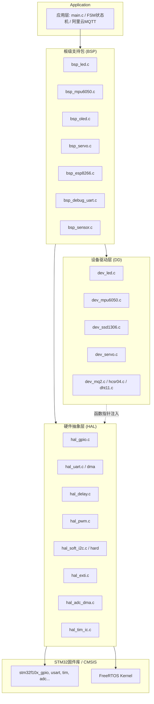

---

# 1. HAL 层 README

## 定位

硬件抽象层（Hardware Abstraction Layer），直接操作 STM32F103 的寄存器与外设库，向上提供**与单片机型号弱相关**的原子操作接口。所有对 MCU 外设（GPIO、USART、TIM、I2C、EXTI、DMA）的访问都必须通过这一层。

## 文件清单

| 文件名 | 说明 |
|--------|------|
| `hal_gpio.c/h` | GPIO 初始化、读/写/翻转，自动使能时钟，模式枚举覆盖推挽、开漏、复用推挽、上拉输入 |
| `hal_delay.c/h` | 微秒/毫秒延时，获取系统 Tick；**支持FreeRTOS与裸机双模式**（由宏 `HAL_USE_FREERTOS` 切换） |
| `hal_uart.c/h` | USART 初始化、字节/字符串发送、单字节接收、中断优先级配置 |
| `hal_uart_dma.c/h` | 为指定 UART 配置 DMA 空闲中断接收（IDLE + DMA），仅负责 DMA 通道初始化 |
| `hal_pwm.c/h` | 定时器时基与四通道 PWM 配置，预设 50Hz 周期（20ms），专为舵机优化 |
| `hal_soft_i2c.c/h` | 软件 I2C 时序模拟（起始、停止、字节发送），用于 OLED 等非标准速率器件 |
| `hal_hard_i2c.c/h` | STM32 硬件 I2C 驱动，含超时检测、总线复位，用于 MPU6050 等标准器件 |
| `hal_exti.c/h` | 外部中断（EXTI）初始化与回调注册，当前仅实现了 PB12（MPU6050 INT 引脚） |
| `hal_adc_dma.c/h` | 封装 ADC 连续转换与 DMA 环形缓冲区后台自动搬运，目前针对单通道（烟雾传感器）设计 |
| `hal_tim_ic.c/h` | 封装高级定时器（TIM1）的输入捕获功能，处理中断极性切换与脉宽计算，用于超声波测距 |

---


## 主要设计约束

- **无业务逻辑**：HAL 层不知道 LED 是高亮还是低亮，也不管舵机角度换算。
- **自动时钟使能**：各模块内部根据传入的 `GPIOx/TIMx/USARTx` 自动开启对应 RCC 时钟，上层无需关心。
- **FreeRTOS 可选**：通过 `HAL_USE_FREERTOS` 宏控制，在 `hal_delay` 中实现调度器感知延时（vTaskDelay 或纯循环），全工程只需修改或注释该宏即可切换裸机/RTOS 模式。
- **统一句柄风格**：每个外设模块定义自己的句柄结构体（如 `UART_Handle_t`, `HardI2C_Handle_t`），方便多实例管理。

## 核心 API 速查

### GPIO
```c
void HAL_GPIO_Init(GPIO_TypeDef* GPIOx, uint16_t GPIO_Pin, HAL_GpioMode_t Mode);
void HAL_GPIO_WritePin(GPIO_TypeDef* GPIOx, uint16_t GPIO_Pin, HAL_PinState_t PinState);
HAL_PinState_t HAL_GPIO_ReadPin(GPIO_TypeDef* GPIOx, uint16_t GPIO_Pin);
void HAL_GPIO_TogglePin(GPIO_TypeDef* GPIOx, uint16_t GPIO_Pin);
```

### Delay
```c
void HAL_Delay_Init(void);          // 系统时钟配置后调用一次
void HAL_Delay_us(uint32_t us);
void HAL_Delay_ms(uint32_t ms);
uint32_t HAL_GetTick(void);         // RTOS 运行时返回 xTaskGetTickCount()
```

### UART
```c
void HAL_UART_Init(UART_Handle_t* hUart);
void HAL_UART_SendByte(UART_Handle_t* hUart, uint8_t byte);
void HAL_UART_SendString(UART_Handle_t* hUart, const char* str);
uint8_t HAL_UART_ReceiveByte(UART_Handle_t* hUart);
void HAL_UART_EnableIRQ(UART_Handle_t* hUart, uint8_t Priority);
```

### UART DMA
```c
void HAL_UART_DMA_Rx_Init(UART_Handle_t* hUart, uint8_t* rx_buffer, uint16_t buffer_size);
```

### PWM
```c
void HAL_PWM_TimerInit(TIM_TypeDef* TIMx);
void HAL_PWM_ConfigChannel(TIM_TypeDef* TIMx, uint8_t Channel);
void HAL_PWM_SetCompare(TIM_TypeDef* TIMx, uint8_t Channel, uint16_t Compare);
```

### ADC + DMA
```c
void HAL_ADC_DMA_Init(ADC_DMA_Handle_t* handle);
```

### Timer Input Capture
```c
void HAL_TIM1_CH4_IC_Init(GPIO_TypeDef* GPIOx, uint16_t GPIO_Pin);
uint32_t HAL_TIM1_CH4_GetPulseWidth(void);
```


### Software I2C
```c
void HAL_SoftI2C_Init(SoftI2C_Handle_t* hI2c);
void HAL_SoftI2C_Start(SoftI2C_Handle_t* hI2c);
void HAL_SoftI2C_Stop(SoftI2C_Handle_t* hI2c);
void HAL_SoftI2C_SendByte(SoftI2C_Handle_t* hI2c, uint8_t byte);
```

### Hardware I2C
```c
void HAL_HardI2C_Init(HardI2C_Handle_t *hI2c);
void HAL_HardI2C_ResetBus(HardI2C_Handle_t *hI2c);
int  HAL_HardI2C_WriteMem(HardI2C_Handle_t *hI2c, uint8_t DevAddr, uint8_t RegAddr, uint8_t *pData, uint16_t Size);
int  HAL_HardI2C_ReadMem(HardI2C_Handle_t *hI2c, uint8_t DevAddr, uint8_t RegAddr, uint8_t *pData, uint16_t Size);
```

### EXTI
```c
void HAL_EXTI_Init_PB12(void);
void HAL_EXTI_RegisterCallback_PB12(EXTI_Callback_t callback);
```

## 注意事项

- `hal_uart_dma` 仅配置了 USART1 和 USART2 的 DMA 通道，若需 USART3 须补充。
- `hal_soft_i2c` 未实现读操作，仅适用于 OLED 纯写场景。
- `hal_hard_i2c` 的超时退出会触发总线复位，适合强实时系统。
- `hal_delay` 的软件循环延时系数 `fac_us_soft` 为经验值，时钟改变需重新校准。

---

# 2. DD 层 README

## 定位

设备驱动层（Device Driver），亦称纯软件逻辑层。此层**完全不依赖任何硬件寄存器**，只通过抽象函数指针（V-Table）与外界交互，面向“逻辑操作”实现算法。具体的硬件操作由上层 BSP 在初始化时注入。

## 文件清单

| 文件名 | 说明 |
|--------|------|
| `dev_led.h` | 定义 LED 抽象接口 `LED_IO_Interface_t`（WritePin, ReadPin）及句柄，逻辑层只关心有效电平（高/低） |
| `dev_led.c` | 实现 LED 的开关、翻转逻辑，翻转时优先使用硬件读取状态，降级为软件状态 |
| `dev_mpu6050.h` | 定义 MPU6050 依赖接口（IO 初始化、寄存器读写、延时、时钟获取），姿态数据结构体 |
| `dev_mpu6050.c` | 封装 DMP 库，完成传感器初始化、校准、FIFO 读取与四元数→欧拉角转换 |
| `dev_servo.h` | 定义舵机句柄及 PWM 写入函数指针，保存角度范围 |
| `dev_servo.c` | 实现角度→脉宽线性换算（0°→500us, 180°→2500us，周期 20ms） |
| `dev_ssd1306.h` | OLED 抽象接口（InitIO, WriteCmd, WriteDat, DelayMs） |
| `dev_ssd1306.c` | OLED 初始化时序、清屏、光标设置、字符/字符串/数字显示（含字模引用） |
| `dev_ssd1306_font.h` | 8x16 字模数据，ASCII 可见字符点阵 |
| `dev_mq2.h/c` | 烟雾传感器抽象层，接收 ADC 原始值，内部实现电压转换与 PPM 浓度线性映射 |
| `dev_hcsr04.h/c` | 超声波传感器抽象层，依赖注入 Trig 脉冲控制与脉宽获取函数，计算物理距离 |
| `dev_dht11.h/c` | 温湿度传感器抽象层，依赖注入微秒延时与引脚操作函数，内部实现协议时序模拟与 Checksum 校验 |
## 设计核心：依赖注入

每个设备驱动定义一个**包含函数指针的结构体**（如 `LED_IO_Interface_t`），作为设备句柄的一部分。例如：

```c
typedef struct {
    void (*WritePin)(uint8_t state);
    uint8_t (*ReadPin)(void);
} LED_IO_Interface_t;
```

句柄 `LED_Handle_t` 持有该接口和逻辑属性。初始化时，由 BSP 层将 HAL 层的具体实现函数注入句柄，完成运行时绑定。这使得 DD 层可以脱离具体硬件仿真测试。

## 主要 API

### LED
```c
void Dev_LED_Init(LED_Handle_t* hLed);
void Dev_LED_On(LED_Handle_t* hLed);
void Dev_LED_Off(LED_Handle_t* hLed);
void Dev_LED_Toggle(LED_Handle_t* hLed);
```

### MPU6050
```c
int  Dev_MPU6050_Init(MPU6050_Handle_t *handle);
void Dev_MPU6050_RunCalibration(void);
int  Dev_MPU6050_Read_DMP(MPU6050_Data_t *out_data);
```
注意：DMP 固件加载后强制等待 10 秒收敛，不可删减去。

### Servo
```c
void Dev_Servo_Init(Servo_Handle_t* hServo, Servo_WritePWM_Func write_func);
void Dev_Servo_SetAngle(Servo_Handle_t* hServo, float angle);
```

### OLED (SSD1306)
```c
void Dev_SSD1306_Init(SSD1306_Handle_t *handle);
void Dev_SSD1306_Clear(SSD1306_Handle_t *handle);
void Dev_SSD1306_ShowChar(...);
void Dev_SSD1306_ShowString(...);
void Dev_SSD1306_ShowNum(...);
void Dev_SSD1306_ShowSignedNum(...);
void Dev_SSD1306_ShowHexNum(...);
void Dev_SSD1306_ShowBinNum(...);
```

### Sensors (MQ2 / HC-SR04 / DHT11)
```c
void Dev_MQ2_Init(MQ2_Handle_t* handle, uint16_t (*read_fn)(void));
float Dev_MQ2_GetPPM(MQ2_Handle_t* handle);

void Dev_HCSR04_Init(HCSR04_Handle_t* handle, void (*trig_fn)(uint8_t), void (*delay_fn)(uint32_t), uint32_t (*ic_fn)(void));
float Dev_HCSR04_GetDistance(HCSR04_Handle_t* handle);

void Dev_DHT11_Init(DHT11_Handle_t* handle);
uint8_t Dev_DHT11_Read(DHT11_Handle_t* handle, uint8_t *temp, uint8_t *humi);
```

## 约束与注意

- MPU6050 驱动强依赖 `inv_mpu` 和 `inv_mpu_dmp_motion_driver` 库，通过全局指针 `g_mpu_handle` 桥接抽象接口。
- 字库 `SSD1306_F8x16` 字符索引从空格(0x20)开始，若传入不可打印字符会越界。
- OLED 坐标：Line 1~4, Column 1~16。

---

# 3. BSP 层 README

## 定位

板级支持包（Board Support Package），负责**实例化硬件资源**，将具体的 MCU 外设、引脚、时钟配置与 DD 层逻辑绑定，形成可供应用层直接调用的接口。

本层知道的硬件细节包括：
- 哪个 GPIO 连接了 LED
- USART1 用于 WiFi，USART2 用于调试
- PB8/PB9 作软件 I2C 驱动 OLED
- MPU6050 使用硬件 I2C2，INT 脚为 PB12
- 8 路舵机分别使用 TIM2/3/4 的特定通道

## 文件清单与资源映射

| 文件 | 对应硬件 | 说明 |
|------|----------|------|
| `bsp_debug_uart.c/h` | USART2, PA2(TX), PA3(RX) | 调试串口，提供 FreeRTOS 队列 `xDebugRxQueue`，可在中断中唤醒解析任务；通过 `ENABLE_DEBUG_PRINT` 宏裁剪 |
| `bsp_esp8266.c/h` | USART1, PA9(TX), PA10(RX) | WiFi 模块，同样使用 DMA+IDLE 接收，数据通过 `xNetRxQueue` 传递 |
| `bsp_led.c/h` | PC13 | 用户 LED1，低电平点亮，初始化后可直接 On/Off/Toggle |
| `bsp_mpu6050.c/h` | I2C2 (PB10, PB11), INT: PB12 | IMU 传感器，若成功初始化则 `g_mpu_is_working=1`，提供数据就绪标志及欧拉角读取 |
| `bsp_oled.c/h` | 软件 I2C: PB8(SCL), PB9(SDA) | 0.96寸 OLED，地址 0x78，扩展了多种显示接口 |
| `bsp_servo.c/h` | TIM2,3,4 的多路 PWM | 8 个舵机（LT/RT/RB/LB 髋/膝关节），每个对应一个 `Servo_Handle_t` |
| `bsp_sensor.c/h` | ADC1_IN4(PA4), TIM1_CH4(PA11), TRIG(PA8), PA15 | 统一管理环境传感器。将 HAL 层函数注入 DD 层句柄，利用 DMA 后台采集烟雾、硬件中断捕获超声波、微秒延时读取 DHT11。 |


## 典型初始化流程

```c
// 在 main() 中依次调用：
BSP_DebugUART_Init(115200);   // 若 ENABLE_DEBUG_PRINT=1，初始化调试串口
BSP_LED_Init();               // 初始化 PC13
BSP_OLED_Init();              // 软件 I2C + SSD1306 初始化
BSP_MPU6050_Init();           // 硬件 I2C + MPU6050 DMP 初始化
BSP_ESP8266_Init(115200);     // WiFi 模块初始化
BSP_Servo_Init();             // 8 路舵机 PWM 初始化
BSP_Sensors_Init();           // 环境传感器 (MQ2, HCSR04, DHT11) 初始化，解绑 PA15 JTAG
```


## 应用接口风格

所有 BSP 接口统一为 `BSP_<模块>_<动作>`，例如：

```c
// LED
void BSP_LED1_On(void);
void BSP_LED1_Off(void);
void BSP_LED1_Toggle(void);

// OLED
void BSP_OLED_Clear(void);
void BSP_OLED_ShowString(uint8_t Line, uint8_t Column, char *String);

// 舵机
void BSP_Servo_Set_Left_Top_Knee(float angle);
void BSP_Servo_Set_Right_Top_Hip(float angle);

// MPU6050
uint8_t BSP_MPU6050_IsDataReady(void);
void BSP_MPU6050_ClearDataReady(void);
int BSP_MPU6050_GetData(MPU6050_Data_t *data);
uint8_t BSP_MPU6050_IsWorking(void);

// ESP8266
void BSP_ESP8266_SendString(const char* str); 

// 调试打印
void BSP_DebugUART_SendString(char* str);

// 环境传感器
float BSP_Sensor_GetDistance(void);
float BSP_Sensor_GetSmoke(void);
uint8_t BSP_Sensor_ReadDHT11(uint8_t *temp, uint8_t *humi);


```

## 关键机制

- **调试输出**：`fputc` 重定向到 USART2，由 `ENABLE_DEBUG_PRINT` 控制。该宏也用来裁剪 `BSP_DebugUART_Init` 和整个调试 ISR。
- **WiFi 与调试队列**：均在各自 UART 中断中利用 DMA+IDLE 接收不定长数据，将包长度放入 FreeRTOS 队列，后续任务可取出长度后处理 `g_xxx_rx_buf`。
- **MPU6050 中断**：PB12 上升沿触发，仅置位 `is_data_ready` 标志，不直接读 FIFO，由任务轮询后调用 `BSP_MPU6050_GetData`。

## 注意事项

- `bsp_esp8266.c` 中的 `printf("[STM32 -> WIFI]: %s", str)` 会无条件发送到 debug 串口，若串口未初始化可能阻塞（由 `fputc` 内宏控制，关闭调试则为空函数）。
- 舵机映射与物理连线强相关，修改硬件后须同步更新 `TIMx_CHy_Write` 与句柄绑定。

---

# 分层架构图 (Mermaid)




**图解**：
- 应用层不直接访问 HAL 或寄存器，只调用 BSP 接口。
- BSP 层实例化 DD 的句柄，并将 HAL 的函数指针注入 DD 层（图中虚线箭头表示间接调用）。
- DD 层仅依赖抽象接口，可脱离硬件进行单元测试。
- HAL 层封装标准外设库，直接操作寄存器，并提供 FreeRTOS 相关的系统调用（如延时、中断唤醒等）。

---
